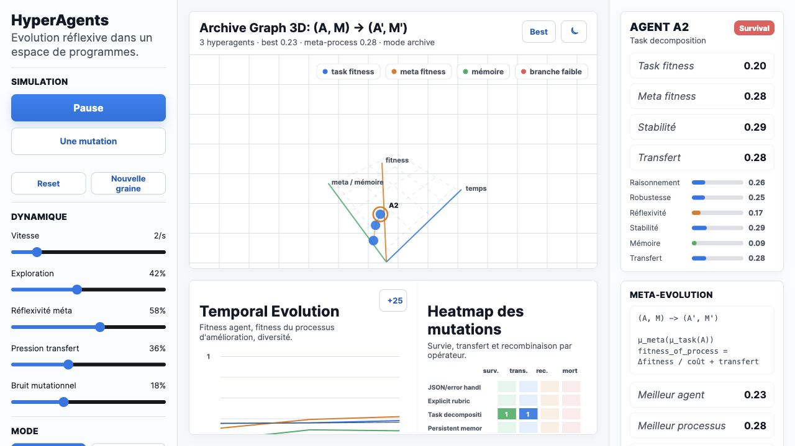

# HyperAgents Reflexive Evolution Simulator

Standalone simulator for visualizing reflexive hyperagents, mutation operators, archive graphs, latent views, and transfer dynamics.

## Live Demo

[Open the Vercel deployment](https://hyperagents.vercel.app)



## Features

- Simulates generations of hyperagents and mutation processes.
- Shows archive, latent, phase, and transfer views.
- Tracks task fitness, meta fitness, diversity, operators, and selected-agent details.
- Single-file static app, deployable without a backend.

## Run Locally

```bash
python3 -m http.server 8775
```

Then open:

```text
http://localhost:8775
```

## Project Structure

```text
index.html       Full standalone simulator
docs/            README screenshot assets
```
